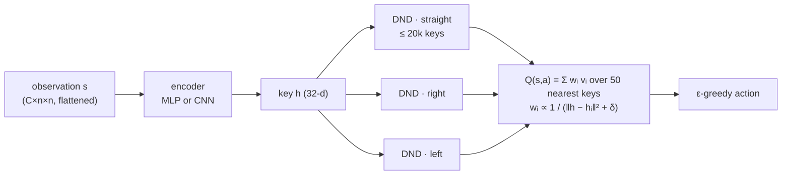
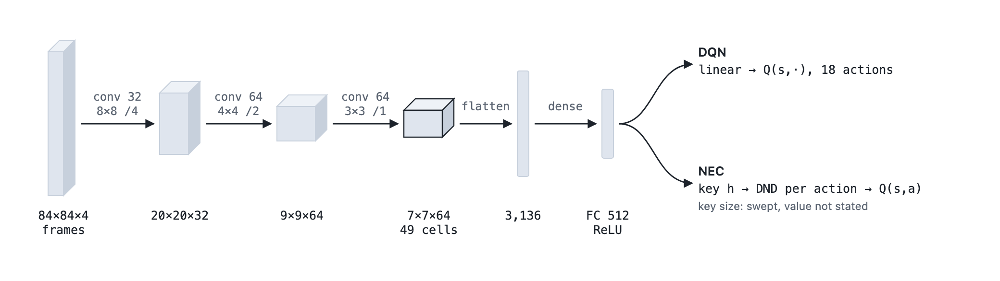
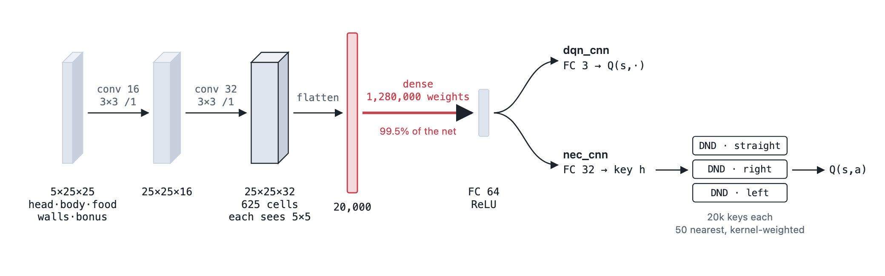
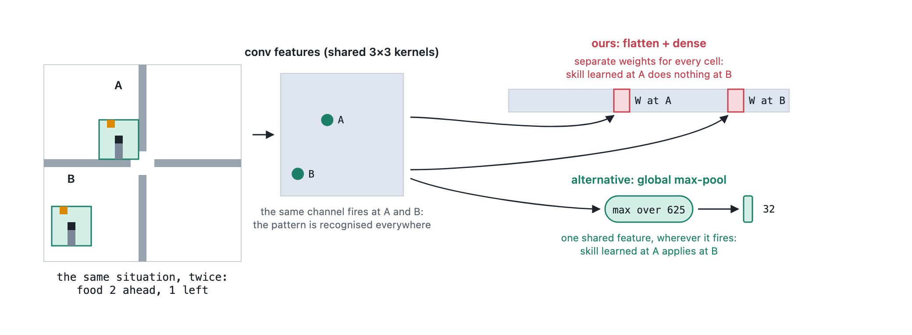
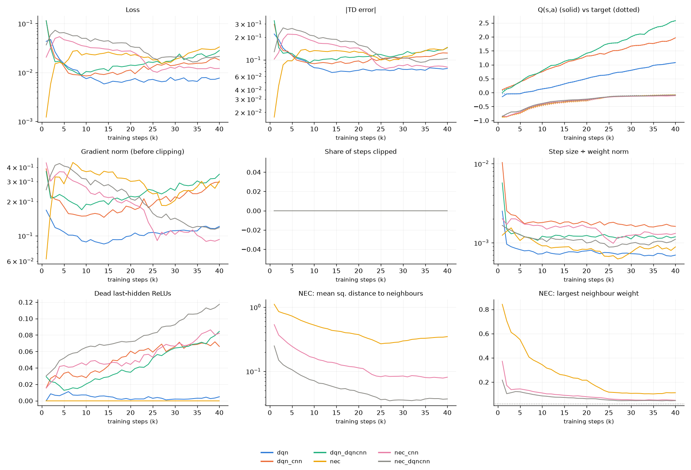
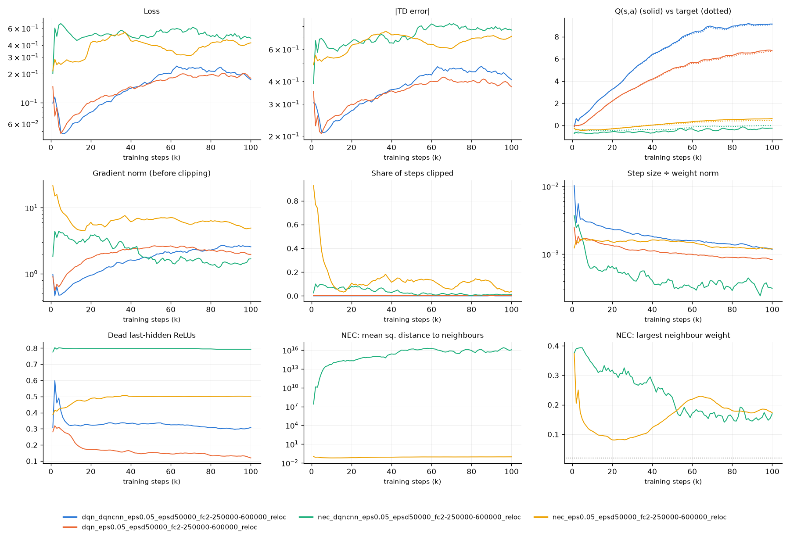

# Neural Episodic Control on Snake: where we are and where we are stuck

*Status as of 2026-10-08. Written for a reviewer coming in cold. Everything below links to the code, the
pre-registered protocols and the reports it summarises.*

## In short

**Goal.** Reproduce Neural Episodic Control (NEC; Pritzel et al., 2017) and the related agents on a small
Snake game, in pure NumPy, then decompose NEC's data-efficiency gain over DQN with an ablation ladder.

**What works.** On small boards (7×7 and 10×10), every agent learns, and the episodic agents behave as the
papers say: MFEC is the most data-efficient when states repeat (section 4).

**What fails.** On the harder board we built for the ablation (25×25 with walls and bonus food), no agent
learns the real game. Four pre-registered pilots (v1–v4) failed their feasibility gate.

**What we know about why:**
1. **Sparse reward was the first obstacle, and it is fixed.** With a food curriculum and food relocation,
   every agent eats thousands of fruit early on (section 5).
2. **Steering is tied to board position.** NEC with an MLP encoder steers to food 91% of the time near the
   start cell, and at chance 10 cells away. No encoder represents the food's position relative to the snake,
   including a CNN (section 6).
3. **NEC with a CNN encoder diverges on 25×25.** Its embedding's norm grows from about 1 to 10³–10⁹ within a
   few thousand steps. The gradient is verified correct. The same CNN trains stably under DQN's loss
   (section 7).

**What we would like help with** is in section 9: mainly, why NEC's embedding diverges with a CNN, and
what a principled fix would be for a reproduction study.

## 1. Project intention

NEC adds three components to a DQN-like learner:
- N-step returns;
- an episodic memory read by kernel-weighted nearest neighbours (the DND, one per action);
- a learned embedding (the memory's keys) trained end-to-end through the kNN lookup.

The study asks **which of these produces NEC's gain in data efficiency**. It uses an ablation ladder that
adds one component at a time:

| Rung | Agent (name in code) | Adds |
|---|---|---|
| 0 | DQN (`dqn`) | — |
| 1 | N-step DQN (`dqn_nstep`) | N-step returns (N = 50) |
| 2 | Frozen-embedding EC (`ec_frozen`) | episodic memory with a random, frozen encoder |
| 3 | NEC (`nec`) | a learned encoder |
| ref | MFEC (`mfec`, Blundell et al., 2016) | random projection + max-return table |
| ref | Random (`random`) | uniform random actions |

**Ground rules:**
- **Pure NumPy, on purpose.** The MLP, CNN, Adam, and every gradient (including through the DND's kNN
  lookup) are hand-written and gradient-checked. No PyTorch, JAX or RL libraries.
- **Pre-registration.** Each experiment has a protocol, run script and analysis script committed before
  its runs, a pilot gate, and a report.
- **Reproducibility.** Runs are bit-for-bit reproducible with one BLAS thread. Every refactor is checked
  against committed runs.

## 2. The environment (`src/snake_rl/env.py`)

- **Board:** n×n. Maps: `open`, `pillars`, `walls`, `rooms`; `rooms` is a cross-shaped wall splitting the
  board into four rooms joined at the centre.
- **Actions:** relative (straight, turn right, turn left).
- **Rewards:** +1 for regular food, −1 for death (wall, obstacle or own body), 0 otherwise.
- **Bonus food** (optional): after every 4 regular fruit in one episode, a bonus pellet worth R points
  appears for 2n steps.
- **Episodes:** end on death, or are truncated after 2n² steps without eating. Truncation bootstraps.
- **Observation:** a top-down image, flattened, with one n×n channel each for:
  - the head;
  - the body;
  - the food;
  - the walls (if the map has any);
  - the bonus pellet (its remaining lifetime);
  - optional channels of pure noise, redrawn every step.
- **Training aids, used from v3 on:**
  - **Food curriculum** (`--food-curriculum R:H:N`): regular food is placed within R walkable steps of the
    head, held at R until step H, then grown linearly to 2n by step N; after that it goes anywhere.
  - **Food relocation** (`--food-relocate`): during the curriculum, food not eaten within 2r + 5 steps is
    placed again within r of the head.
  - **Evaluation runs** always use the real game: food anywhere, no relocation.

**The hard configuration (v1 onwards):**
- a 25×25 `rooms` board with bonus food worth 5;
- 5 observation channels (3,125 inputs);
- an idle limit of 1,250 steps.

Under uniform placement, food starts on average about 13 walkable steps from the head.

## 3. Agents and architecture

### 3.1 NEC as implemented (`src/snake_rl/agents/nec.py`)



- **Fast path:** after N steps, the N-step target `G + γᴺ max_a Q(s_{t+N}, a)` is written to the taken
  action's DND.
  - On an exact key match, the stored value moves towards it: `v ← v + α (target − v)`, with α = 0.1.
  - Otherwise the key is appended. When the DND is full, the row least recently used as a neighbour is
    evicted.
- **Slow path:** every 4 steps, a minibatch of 32 from a 20k replay of (observation, action, target)
  minimises `½ (Q(s,a) − target)²`. The hand-derived gradient flows three ways:
  - into the encoder (Adam, lr 5 × 10⁻⁴, global-norm clip 10);
  - into the neighbour keys (plain SGD, rate 10⁻²);
  - into the neighbour values (plain SGD, rate 10⁻²).
- **Kernel:** `k(h, hᵢ) = 1 / (‖h − hᵢ‖² + δ)` with δ = 10⁻³, normalised over the p = 50 nearest
  neighbours (exact brute-force kNN).
- **Ablation flags:**
  - `learn_embedding=False` (frozen EC) disables the slow path entirely.
  - `nec_refresh` re-embeds all stored keys periodically (not in the paper).

### 3.2 Encoders (`src/snake_rl/nn.py`)

| Encoder | Layers | 25×25 rooms: weights | Used by |
|---|---|---|---|
| MLP (default) | 3,125 → 64 → 32 (NEC key) or → 64 → 3 (DQN, two hidden layers) | ~0.2M | `nec`, `dqn`, … |
| Small CNN | conv 16 3×3/1 → conv 32 3×3/1 → FC 64 → head | ~1.29M (99.5% in the FC reading 25×25×32 = 20,000 features) | `nec_cnn`, `dqn_cnn` |
| DQN-shaped CNN (new) | conv 32 3×3/1 → conv 64 3×3/2 → conv 64 3×3/2 → FC 512 → head; map 25 → 13 → 7 | ~1.67M | `nec_dqncnn`, `dqn_dqncnn` |



*The paper's encoder (DQN's network on 84×84 Atari frames). Strided convolutions shrink the image to a 7×7 map
before the one dense layer, whose output is either DQN's Q-values or NEC's key.*



*Our small CNN (`*_cnn`). Stride 1 throughout, so the map stays 25×25, and the dense layer reads 20,000
position-specific features. It holds 99.5% of the weights.*

The DQN-shaped CNN copies the shape of DQN's network (Mnih et al., 2015: 32 8×8/4 → 64 4×4/2 → 64 3×3/1 →
FC 512). It is scaled to the grid so that the map entering the dense layer is 7×7, as on Atari. The paper
says only that NEC uses "the same convolutional architecture as DQN". It does not report the key size,
which it tuned in a sweep.

### 3.3 Other agents

- **DQN:**
  - Huber loss, a target network synced every 1,000 steps;
  - replay 50k, batch 32, one update every 4 steps, Adam lr 5 × 10⁻⁴;
  - N = 1, or N = 50 for N-step DQN.
- **MFEC:**
  - a fixed Gaussian random projection to 64-d;
  - one buffer of 20k entries per action;
  - Q = the mean over k = 11 neighbours, or the stored value on an exact match;
  - Monte Carlo returns written at episode end with a max update.

### 3.4 Deliberate differences from the NEC paper

| | Paper | Ours | Why |
|---|---|---|---|
| Optimiser | RMSProp | Adam (encoder), plain SGD (memory) | small problem; kept until the pipeline is verified |
| N-step horizon | 100 | 50 | shorter episodes than Atari |
| DND capacity per action | 5 × 10⁵ | 2 × 10⁴ | small state space |
| kNN | approximate (kd-trees) | exact, brute force | fits in memory |
| Encoder | DQN's CNN on 84×84 frames | MLP by default; two CNNs on the 25×25 grid | see 3.2 |
| Key size | swept, value not reported | 32 | |
| p, δ, batch, update frequency | 50, 10⁻³, 32, every 16 frames | 50, 10⁻³, 32, every 4 agent steps | same (we use no action repeat) |

## 4. What works: small boards

[MFEC vs DQN vs NEC](experiments/mfec_dqn_nec/REPORT.md) (pre-registered; 120 runs; 10 seeds per cell).
Fruit per episode over the second half of training:

| Configuration | Random | DQN | NEC | MFEC |
|---|---|---|---|---|
| 7×7, clean, 40k steps | 0.21 | 1.04 | 1.01 | **1.58** |
| 7×7, 4 noise channels | 0.21 | **0.45** | 0.25 | 0.23 |
| 10×10, clean, 60k steps | 0.17 | 0.60 | 0.23 | **0.66** |

- **MFEC wins when states repeat exactly.** About a quarter of its decisions hit an exactly stored state.
- **Episodic agents collapse with noise channels,** because kNN in raw space becomes random.
- **NEC already weakens at 10×10.** It drops close to random there, an early hint of the scaling problem.

## 5. The 25×25 board: four pre-registered pilots (v1–v4)

Every version used 3 pilot seeds and the same gate: at least 3 of the 4 ladder agents must score 0.5
points per episode above random over the second half of training. **All four failed with 0 of 4.**

| Version | What changed | Best agent vs gate (needs ≥ ~0.51) | What the pilot showed | Report |
|---|---|---|---|---|
| v1 | 25×25 rooms, bonus 5; one short ε schedule (1 → 0.02 over 5k); 150k, then 300k steps | DQN 0.12 | agents learn to survive, not to eat; food too rare; bonus never appears | [v1](experiments/nec_ladder_g25/REPORT.md) |
| v2 | each paper's ε (DQN 1 → 0.1 over 250k; episodic agents 0.005); evaluation runs at ε 0.05; 1M steps | frozen EC 0.084 | the DQN family eats by turnover only; episodic agents wander to the idle limit | [v2](experiments/nec_ladder_g25_paper_eps/REPORT.md) |
| v3 | + food curriculum (radius 2 → 50 over 600k) | DQN 0.080 | the curriculum's easy phase came while DQN still explored randomly; episodic agents left nearby food behind | [v3](experiments/nec_ladder_g25_food_curriculum/REPORT.md) |
| v4 | radius held at 2 until 250k, then grown; + food relocation | DQN 0.072 | **reward signal fixed** (every agent eats thousands of fruit early, bonus appears), yet no agent steers to food even 2 cells away | [v4](experiments/nec_ladder_g25_food_relocation/REPORT.md) |

**v4's held phase**, with food always within 2 steps (100k–250k):

| Agent | Fruit per 100 steps |
|---|---|
| Random | 6.6 |
| DQN | 10.3 |
| N-step DQN | 12.5 |
| Frozen EC | 4.9 |
| NEC (ε 0.005) | **1.4** |
| MFEC | 5.6 |

As the radius grows, every agent falls to random's rate by radius ~10. v4's report proposed the
representation as the bottleneck: "food two cells ahead-left" is a different input pattern at each of the
625 head positions and 4 headings.

## 6. Testing the representation hypothesis

[Encoder food probe](experiments/encoder_food_probe_g25/REPORT.md) (exploratory, pre-registered by hash).

**Design:**
- **Agents:** {NEC, DQN} × {MLP, small CNN}, plus random; 5 seeds each.
- **Environment:** v4's.
- **Matched exploration:** the same ε schedule for all agents (1 → 0.05 over 50k), removing v1–v4's
  exploration confound.
- **Length:** 400k steps.

**A representation probe** (`src/snake_rl/probe.py`) runs every 25k steps on 1,293 hand-built states:
150 snake configurations × every food cell within 2 steps. It measures:
- **Greedy steering:** P(the action moves along a shortest path to the food).
- **kNN purity:** do nearest neighbours in embedding space share the same egocentric food offset?
- **Linear read-out** of that offset (10 classes).
- **Food/position ratio:** how much the embedding moves when only the food moves, relative to when the
  snake moves.

**Results at 250k** (end of the held phase):

| Agent | Steering (chance 0.396) | Training fruit / 100 steps | Read-out of food offset (chance 0.10) | Food/position ratio |
|---|---|---|---|---|
| Raw observation | — | — | 0.06 | 0.50 |
| DQN · MLP | 0.417 | 7.2 | 0.101 | 0.42 |
| DQN · CNN | 0.446 | 8.2 | 0.128 | 0.10 |
| NEC · MLP | 0.394 | **25.6** | 0.097 | 0.46 |
| NEC · CNN | 0.399 | 6.8 | 0.108 | 0.11 |

**The post-hoc diagnostic** (one seed per agent, chosen after seeing the data) resolves NEC·MLP's high fruit
rate alongside chance-level probe steering. It measures greedy steering on the agent's own states, split by
the head's distance from the start cell:

| Distance from start cell | 0–2 | 3–5 | 6–9 | 10+ |
|---|---|---|---|---|
| NEC · MLP | **0.91** | **0.79** | 0.59 | 0.42 |
| NEC · CNN | 0.86 | 0.42 | 0.46 | 0.46 |
| DQN · CNN | 0.59 | 0.49 | 0.44 | 0.28 |
| DQN · MLP | 0.34 | 0.44 | 0.39 | 0.43 |

**Reading:**
- **NEC can learn to steer, but only where it has been.** 83% of NEC·MLP's states are within 5 cells of the
  start, where it steers well.
- **The probe missed it** because it samples the whole board.
- **The CNN does not carry the skill across positions:**
  - its convolutions are shared across the board, but the dense layer reading 625 positions is not;
  - in every arm, the embedding is organised by where the snake is, not by where the food is relative to
    it.



*Why skills end up tied to positions. Shared convolutions detect "food 2 ahead, 1 left" wherever it occurs.
The flatten-and-dense step gives each board cell its own weights, though, so what is learned at A does not
transfer to B. Global pooling, shown for contrast, is not part of the paper's architecture: we drew it as a
possible diagnostic, not a proposed fix.*


## 7. The problem we are stuck on: NEC's embedding diverges with CNN encoders

We added training telemetry (`src/snake_rl/telemetry.py`; plotted by `snake-train`), logged every 1,000
steps:
- loss, |TD error|, Q and its target;
- gradient norm and share of clipped steps;
- step size relative to the weight norm;
- dead ReLUs;
- for NEC: the distance to memory neighbours and the largest kernel weight.

We then ran a health check, one seed per agent.

**Easy task (7×7 open, 40k steps):** everything learns, and the telemetry looks textbook.

| Agent | Points per episode (last 5k steps) |
|---|---|
| Random | 0.17 |
| DQN | 1.28 |
| DQN · small CNN | 3.46 |
| DQN · DQN-shaped CNN | 2.85 |
| NEC | 0.85 |
| NEC · small CNN | 0.42 |
| NEC · DQN-shaped CNN | 0.39 |



**Target task (25×25 rooms, held phase, 100k steps):**

| Agent | State at 100k | Fruit / 100 steps |
|---|---|---|
| DQN · MLP | healthy: Q tracks target (≈ 6.6), no clipping, step/weight ≈ 10⁻³, 12% dead ReLUs | 9.4 |
| DQN · DQN-shaped CNN | healthy: Q ≈ 9, no clipping, 31% dead ReLUs | 11.7 |
| NEC · MLP | stable key norm (0.9–1.0), but 50% dead ReLUs; gradient clipped on 84–100% of updates in the first 1,200 steps (norm ~20 vs clip 10) | 22.4 |
| NEC · DQN-shaped CNN | **diverged**: key norm 1.1 → 4 × 10³ by step 1k → 2 × 10⁹; neighbour distance ~10¹⁶; 80% dead ReLUs | 3.2 |



**Early trajectory of the encoder** (25×25, the same seed for all three):

| Steps | NEC · DQN-shaped CNN key norm | NEC · small CNN key norm | NEC · MLP key norm |
|---|---|---|---|
| 0 (init) | 1.1 | 0.84 | 0.85 |
| 100 | 2.4 | 9.2 | 0.89 |
| 400 | 94 | 112 | 0.87 |
| 1,200 | 3.6 × 10⁴ | 2.8 × 10³ | 0.88 |

Meanwhile:
- the weight norms grow by only 1.0–1.3× (DQN-shaped CNN) and 1.0–2.2× (small CNN), so the weights align
  rather than grow;
- dead ReLUs rise from about 35% to about 80% within the first 200–400 steps;
- the gradient is clipped on at most 6% of updates.

**The experiment's own run had the same problem.** Last night's NEC·CNN arm (section 6) ended at step 250k
with key norm 6.7 × 10³ (stored keys 1.1 × 10⁴), against 1.15 for NEC·MLP. That arm's results are invalid
for the CNN question. The report has an addendum saying so.

## 8. What we have tried or ruled out

| # | Attempt | Result |
|---|---|---|
| 1 | Longer budget (v1: 150k → 300k) | no change |
| 2 | Each paper's exploration schedule, evaluation-run scoring, 1M steps (v2) | no change |
| 3 | Food-distance curriculum (v3) | no change; mistimed for DQN; episodic agents left food behind |
| 4 | Held curriculum + food relocation (v4) | **fixed the reward signal**; still no steering |
| 5 | Matched exploration across agents (probe experiment) | NEC·MLP's held-phase fruit rate went from 1.4 to 25.6 per 100 steps |
| 6 | CNN encoder (stride-1) instead of MLP | DQN: small, consistent steering gain; NEC: embedding diverged |
| 7 | DQN-shaped CNN (strided, FC 512) | DQN: healthy and best fruit rate; NEC: embedding diverged |
| 8 | Checked NEC's hand-written gradient against finite differences | correct (worst relative error 3 × 10⁻⁷; now a unit test) |
| 9 | Checked the strided CNN's backprop against finite differences | correct (unit test) |
| 10 | Checked that telemetry, probes, evaluation and checkpoints change nothing | bit-for-bit identical to committed runs |
| 11 | Watched trained agents play (`snake-watch`) | tooling ready; not yet used systematically on the 25×25 agents |

**Not tried yet:**
- normalising or bounding the keys;
- clipping the memory-key updates;
- a lower encoder learning rate;
- RMSProp;
- an egocentric (head-centred, rotated) observation;
- a position-invariant CNN head (global pooling).

## 9. Hypotheses and questions for the reviewer

**H1. Scale has no restoring force in NEC's loss** (our leading guess for section 7; untested).
- When neighbour distances are much larger than δ, the kernel weights `wᵢ = kᵢ / Σ kⱼ` are invariant to a
  common rescaling of all keys. So the loss is nearly flat along the embedding's scale.
- With Adam's normalised steps and a wide dense layer summing hundreds of board positions, the weights can
  drift into alignment, and the output norm grows multiplicatively.
- The MLP encoder may be spared because its embedding starts with larger relative distances, or because it
  has fewer, narrower layers. We have not tested either explanation.

**H2. Mass ReLU death couples with H1.** Dead units rise to about 80% in the first few hundred steps, just as
the norm takes off. We do not know which comes first.

**H3. Position-bound representations limit every agent here.**
- The input is allocentric, and every encoder ends in a dense layer over board positions.
- NEC's memory amplifies this: Q is an average over neighbours that share the snake's position more than its
  situation.

**Questions:**
1. Is this divergence a known failure mode of NEC (or of kernel-based memories trained end-to-end), and does
   H1 make sense?
2. What is a principled fix that keeps the study a fair reproduction? Candidates:
   - L2-normalised keys;
   - weight decay on the encoder;
   - clipping or a lower rate for the memory-key SGD;
   - the paper's RMSProp;
   - a smaller encoder learning rate.

   Do any of these change NEC in a way that would invalidate the comparison?
3. Is the initial dead-ReLU spike in NEC's encoder something to fix directly (initialisation, a leaky
   activation), or a symptom?
4. For position-general steering, is an egocentric observation acceptable in a reproduction study, or
   should the fix be architectural (pooling)?
5. Is our probe (section 6) a sound measure of "the encoder represents where the food is"? What would you
   measure instead?
6. Is 25×25 `rooms` with bonus food a reasonable testbed for NEC's data-efficiency claim, given that the
   paper's setting is Atari with a much larger memory?

## 10. Reproducing anything here

```sh
python3 -m venv .venv && .venv/bin/pip install -e '.[dev]'
export OMP_NUM_THREADS=1 OPENBLAS_NUM_THREADS=1 MKL_NUM_THREADS=1 VECLIB_MAXIMUM_THREADS=1   # bit-for-bit runs

# one 25x25 health-check run (as in section 7), then its training curves
.venv/bin/snake-run nec_dqncnn 601 100000 0 25 --map rooms --bonus 5 \
    --food-curriculum 2:250000:600000 --food-relocate --eps-floor 0.05 --eps-decay 50000 \
    --probe-every 25000 --save-every 25000
.venv/bin/snake-train results/g25_d0_rooms_b5/nec_dqncnn_*_s601.json

# watch a saved checkpoint play
.venv/bin/snake-watch results/g25_d0_rooms_b5/nec_dqncnn_*_s601.agent_t25000.pkl --food-radius 2 --relocate

.venv/bin/pytest   # gradient checks, RNG-neutrality checks, smoke runs of every agent
```

| Where | What |
|---|---|
| `src/snake_rl/` | env, networks, agents, training loop (`run.py`), probe, telemetry, plotting and viewer |
| `docs/experiments/*/` | each experiment's `PROTOCOL.md`, `run.sh`, `analyze.py`, `REPORT.md` |
| `results/exp_*/` | raw per-run JSON of every experiment above |
| `logs/` | stdout of every sweep |
| `figures/health/` | the telemetry figures in section 7 |
| `docs/figures/` | the architecture diagrams in sections 3 and 6 |
| `README.md` | commands and options; `CLAUDE.md`, notes on the code's conventions |
