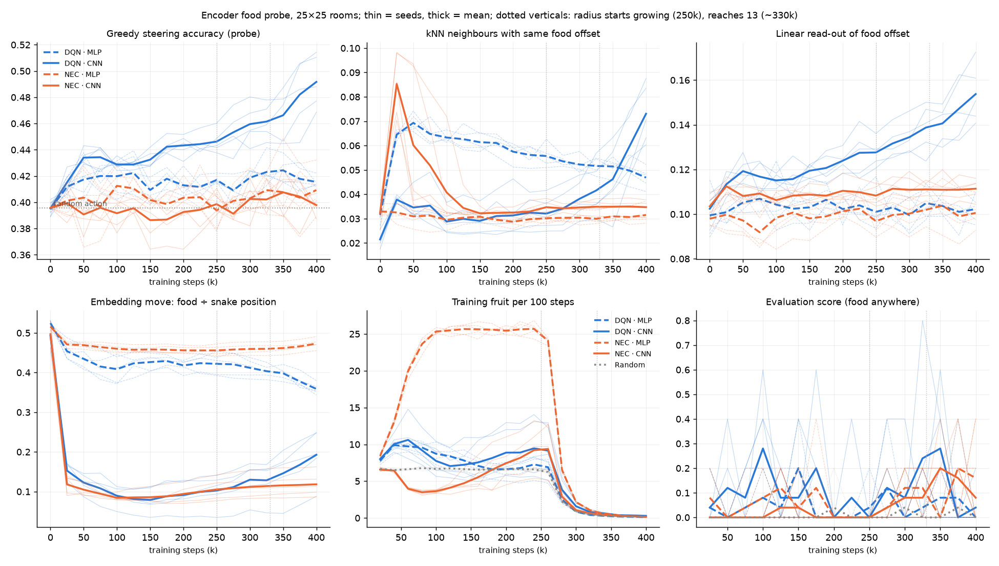

# Experiment report: can the encoder tell where the food is? MLP vs CNN, NEC vs DQN, matched exploration

**Status: complete (exploratory).** All 25 runs finished, and the frozen files match their hashes.
- **Probe in context:** `PROTOCOL.md`, `run.sh`, `analyze.py` and `src/snake_rl/probe.py` all report `OK`
  under `shasum -c FROZEN.sha256`.
- **Runs:** 2026-10-07 22:04Z to 2026-10-08 02:21Z, in `results/exp_encoder_probe/`, with the log in
  `logs/exp_encoder_probe.log`.
- **Outputs:** [`results.md`](results.md), [`per_run.csv`](per_run.csv) and
  [`probe_curves.png`](probe_curves.png), all from `analyze.py`.
- **Post-hoc diagnostic** (section 4; *not* pre-registered): [`posthoc/`](posthoc/).
- **Authorship:** the experimenter asked for this experiment and then left. Claude made the design choices,
  and they are marked *decision* in the protocol.

## 1. Recap

**Hypothesis:** v4's agents fail to steer because their encoder does not represent where the food is
relative to the snake.

**Design:** a 2 × 2 of {NEC, DQN} × {MLP, CNN} encoder, plus random, with 5 seeds each (501–505).
- **Environment:** v4's: 25×25 `rooms`, bonus 5, food radius held at 2 until 250k, relocation on.
- **Exploration:** **one ε schedule for every agent**, 1 → 0.05 over 50k steps.
- **Length:** 400k steps.
- **Probe:** a fixed probe set every 25k steps, scoring greedy steering and how well the embedding separates
  the egocentric food offset. Outcomes are read at 250k.

## 2. Checks

| # | Check | Result |
|---|---|---|
| B1 | Probe leaves training unchanged | Unit test passes for every agent. Post hoc, the four seed-501 runs were reproduced bit-for-bit to 250k without the probe (`reproduces: True`). |
| B4 | Enough reward | Every agent eats thousands of fruit in the held phase, 6.6–25.6 per 100 steps. |
| B5 | All runs recorded | 25 of 25 files, each with probes at 0, 25k, …, 400k. |
| B2 | Probe states resemble training states | **Failed for the episodic agent, and this matters.** See section 4: NEC·MLP's states sit almost entirely near the start cell, and the probe's states mostly do not. |

## 3. Pre-registered results (at 250k; full tables in `results.md`)

| Agent | steer (chance 0.396) | Training fruit / 100 steps (100–250k) | knn_offset | knn_config | decode (chance 0.10) | food_ratio |
|---|---|---|---|---|---|---|
| Raw observation | — | — | 0.017 | 0.80 | 0.06 | 0.50 |
| Random | — | 6.6 | — | — | — | — |
| DQN · MLP | 0.417 | 7.2 | 0.056 | 0.44 | 0.101 | 0.42 |
| DQN · CNN | **0.446** | 8.2 | 0.032 | 0.73 | **0.128** | 0.10 |
| NEC · MLP | 0.394 | **25.6** | 0.030 | 0.69 | 0.097 | 0.46 |
| NEC · CNN | 0.399 | 6.8 | 0.035 | 0.66 | 0.108 | 0.11 |

**CNN − MLP** (bootstrap 95% CI; p is the exact permutation test, 252 relabelings, descriptive):

| | DQN | NEC |
|---|---|---|
| steer | +0.029 [+0.023, +0.037], p 0.008 | +0.005 [−0.008, +0.017], p 0.52 |
| decode | +0.027 [+0.018, +0.034], p 0.008 | +0.011 [+0.005, +0.017], p 0.03 |
| knn_offset | −0.024 [−0.030, −0.017], p 0.008 | +0.005 [+0.001, +0.007], p 0.04 |
| food_ratio | −0.32 [−0.36, −0.28], p 0.008 | −0.35 [−0.37, −0.33], p 0.008 |
| fruit / 100 steps | +1.0 [−1.3, +3.4], p 0.47 | −18.9 [−20.5, −17.1], p 0.008 |

**The pre-registered reading** (PROTOCOL.md section 4):
- **No arm "clearly" improves steering.** That bar was a CI excluding 0 *and* steer at least 0.10 above
  chance. The best arm, DQN·CNN, is +0.05 above chance at 250k, rising to about +0.10 by 400k.
- **The representation barely moves with either encoder:**
  - every `decode` is at most 0.13, against 0.10 chance;
  - every `knn_offset` is at most 0.06.
  - The CNN makes `food_ratio` *worse* (0.42–0.46 → about 0.10): its embedding moves about ten times more when
    the snake moves than when the food moves.
- **This matches the third row:** "neither encoder represents the offset". That is **consistent with H, but
  not a test of encoders in general**. The CNN's dense layer over 32 × 625 position-specific features puts
  the position-dependence back.
- **The one surprise:** NEC·MLP eats 3.9× random's rate (25.6 vs 6.6 per 100 steps) while its probe steering
  is at chance. Section 4 resolves this.

## 4. Post-hoc diagnostic: where do the agents steer? (exploratory; one seed per agent)

Not pre-registered. It was prompted by the NEC·MLP mismatch above.
- **Snapshots:** the four seed-501 runs were reproduced to 250k (bit-for-bit) and pickled.
- **On-policy steering:** each agent played 4,000 greedy steps in the held-phase environment, on a fresh env
  stream.
- **Split:** steering on its own states and on 1,500 probe configurations, by the head's Manhattan distance
  from the start cell (12, 12).
- **Outputs:** in `posthoc/`.

**Greedy steering on the agent's own states**, P(action on a shortest path to the food); chance is about 0.37:

| Head distance from start | 0–2 | 3–5 | 6–9 | 10+ | Fruit / 100 greedy steps |
|---|---|---|---|---|---|
| NEC · MLP | **0.91** | **0.79** | 0.59 | 0.42 | 29.1 |
| NEC · CNN | **0.86** | 0.42 | 0.46 | 0.46 | 1.9 |
| DQN · CNN | 0.59 | 0.49 | 0.44 | 0.28 | 11.0 |
| DQN · MLP | 0.34 | 0.44 | 0.39 | 0.43 | 5.2 |

**Share of NEC·MLP's on-policy states in each band:** 41%, 42%, 13%, 4%. On the probe set (straight snakes
anywhere), steering for every agent is at chance beyond 6 cells. It is at most 0.49 (NEC·MLP) and 0.61
(DQN·CNN) within 2 cells of the start.

**What this shows:**
1. **NEC can learn to steer, but only where it has been.** NEC·MLP steers at 0.91 around the start cell, which
   is better than any DQN arm anywhere. That skill fades to chance about 10 cells away, so it is local.
   - **Its policy keeps it in that region:** episodes start at the centre, relocation keeps food within 2
     steps, and the snake eats roughly every 4 steps.
   - **Why the board-wide probe missed it:** it samples mostly positions the agent never visits.
2. **The CNN does not transfer the skill across positions:**
   - **NEC·CNN** has the same island at the start (0.86) and is at chance everywhere else. It also leaves the
     island early: 89% of its states are 10 or more cells away, and it eats less than random.
   - **DQN·CNN** is the closest to position-general, but it too declines with distance (0.59 → 0.28).
3. **Steering and representation agree:**
   - steering is tied to board position;
   - the embedding is dominated by board position (`knn_config` 0.44–0.73, `food_ratio` 0.10–0.46);
   - the egocentric offset is not linearly readable (`decode` ≈ chance).

These are one seed per agent, and the diagnostic was chosen after seeing the data. Read it as strong
description, not a test.

## 5. Conclusion

**On the hypothesis:**
- **Supported, in a sharpened form.** The obstacle is not that the agents cannot learn to steer. It is that
  what they learn is **tied to the board position where they learned it**. "Food two cells ahead-left" near
  the centre and the same situation in a corner are, to these encoders, unrelated states.
- **Evidence for that form:**
  - NEC with an MLP learns near-perfect steering where it trains, and none elsewhere;
  - in every arm, the embeddings are organised by snake position, not by food offset.

**The CNN, as built, does not fix it:**
- the 3×3 stride-1 convolutions are position-shared, but the dense layer reads 20,000 position-specific
  features;
- it is also about 10× slower;
- in NEC it hurt fruit collection (6.8 vs 25.6 per 100 steps);
- in DQN it gave a small, consistent gain in steering (+0.03 at 250k, still growing at 400k).

**Matched exploration** removed v4's confound and changed the picture for NEC: with ε 1 → 0.05, NEC·MLP
collects 25.6 fruit per 100 steps in the held phase, against 1.4 in v4 at ε 0.005. Part of v4's NEC failure
was exploration. This comparison was not pre-registered, and v4 differs in other settings too.

## 6. Deviations, limitations

- **Deviations from the frozen protocol:** none.
- **Additions after the fact:**
  - the post-hoc diagnostic (section 4, `posthoc/`);
  - in `CLAUDE.md`, one line documenting `probe.py`.
- **Limitations:**
  - **5 seeds per arm, exploratory, no multiplicity control.** Several CIs are tight because between-seed
    variance is small, not because effects are large.
  - **Fixed probe snakes:** probe snakes are length 3 and straight. NEC·MLP's real snakes stay short (about
    16-step episodes), but DQN·CNN's grow (about 84-step episodes).
  - **Only one CNN:** one architecture was tried, the repo's existing one. A CNN with global pooling, or any
    head that ignores absolute position, was not.
  - **A single read-out step:** the outcomes are read at 250k only. DQN·CNN's steering and decode were still
    rising at 400k.

## 7. Next steps (for discussion; not pre-registered)

1. **An egocentric observation** (head-centred and rotated, as v4 suggested). The evidence now points
   squarely at absolute position, and this removes it from the input for every encoder.
   - **The decisive check:** the same 2 × 2 (or just NEC·MLP vs DQN·MLP) with that observation, reusing this
     probe.
   - **Prediction under H:** probe steering at least 0.8 *at all distances*, not only near the start cell.
2. **Alternatively,** a position-invariant CNN head (global max/average pooling over the conv map), keeping
   the top-down observation. This tests "encoder" in the narrow sense the user asked about.
3. **Make the probe a split metric:** report the distance-from-start split in `probe.py`, so that local
   islands of skill are visible without post-hoc work.
