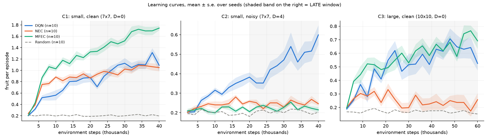

# Experiment report: MFEC vs DQN vs NEC on Snake

- **Plan:** [`PROTOCOL.md`](PROTOCOL.md), frozen at 2026-10-05T14:58:15Z before any confirmatory run.
  [`FROZEN.sha256`](FROZEN.sha256) holds the hashes of the protocol, `run.sh` and `analyze.py`. All
  three still matched after the runs.
- **Runs:** 2026-10-05, 14:58:18Z to 15:15:23Z. 120 of 120 runs completed, with no failures or
  reruns.
- **Raw outputs:** [`results.md`](results.md) (every number below comes from it),
  [`per_run.csv`](per_run.csv), [`learning_curves.png`](learning_curves.png), `results/exp_mfec/`,
  and `logs/exp_mfec.log`.

## 1. Recap of the plan

**Question.** How does MFEC (Blundell et al., 2016) compare with DQN and NEC on our Snake game? We
looked at final play quality, learning speed, robustness to irrelevant inputs, and a larger board.

**Task in plain words.**
- The snake moves on an n×n board, choosing straight, right or left each step.
- Food gives +1, a crash gives −1 and ends the episode, and 2·n² steps without food also end it.
- An episode's *score* is the number of fruit eaten.
- The agent sees three n×n binary images (head, body, food).
- **Noise channels:** in one configuration we append 4 extra n×n images of pure coin-flip noise,
  redrawn every step. They carry no information about the game. They make the same game situation
  look different every time, so an agent must learn to ignore them.

**Configurations** (10 seeds each, seeds 101–110, which were not used in the pilot):

| ID | Board | Noise channels | Steps per run |
|---|---|---|---|
| C1 small, clean | 7×7 | 0 | 40,000 |
| C2 small, noisy | 7×7 | 4 | 40,000 |
| C3 large, clean | 10×10 | 0 | 60,000 |

**Agents** (untuned defaults; see the protocol's section 3):
- `dqn`: a neural Q-network.
- `nec`: a learned encoder plus a differentiable kNN memory.
- `mfec`: a fixed random projection plus a kNN memory of the best Monte Carlo return seen.
- `random`: a uniform-random policy, used only as a floor.

All four share the same ε-greedy schedule: 1 → 0.02 over the first 5k steps.

**Outcomes** (one number per run):
- **LATE:** mean score per episode over the second half of training.
- **EARLY:** mean score per episode in steps 5k–10k, right after exploration stops.

**Tests:**
- An exact two-sided permutation test on the difference in means (10 vs 10 runs).
- A Holm correction over the 7 confirmatory hypotheses, family-wise α = 0.05.
- Effect sizes: the mean difference with a bootstrap 95% CI, and Hedges' g.

## 2. Results

### 2.1 Primary outcomes (mean ± s.d. over 10 runs, [95% bootstrap CI of the mean])

**LATE: fruit per episode, second half of training**

| | Random | DQN | NEC | MFEC |
|---|---|---|---|---|
| C1 small, clean | 0.21 ± 0.01 | 1.04 ± 0.12 [0.97, 1.12] | 1.01 ± 0.15 [0.93, 1.10] | **1.58 ± 0.15** [1.50, 1.67] |
| C2 small, noisy | 0.21 ± 0.01 | **0.45 ± 0.12** [0.39, 0.52] | 0.25 ± 0.02 [0.24, 0.26] | 0.23 ± 0.01 [0.22, 0.23] |
| C3 large, clean | 0.17 ± 0.01 | 0.60 ± 0.10 [0.54, 0.66] | 0.23 ± 0.08 [0.19, 0.28] | **0.66 ± 0.06** [0.62, 0.70] |

**EARLY: fruit per episode, steps 5k–10k**

| | Random | DQN | NEC | MFEC |
|---|---|---|---|---|
| C1 small, clean | 0.21 ± 0.02 | 0.53 ± 0.20 [0.41, 0.65] | 0.83 ± 0.09 [0.77, 0.88] | **1.00 ± 0.13** [0.93, 1.09] |
| C2 small, noisy | 0.21 ± 0.02 | **0.30 ± 0.04** [0.28, 0.32] | 0.24 ± 0.03 [0.22, 0.26] | 0.21 ± 0.02 [0.20, 0.22] |
| C3 large, clean | 0.17 ± 0.03 | 0.32 ± 0.05 [0.29, 0.35] | 0.30 ± 0.09 [0.25, 0.36] | **0.48 ± 0.19** [0.37, 0.59] |

### 2.2 Confirmatory hypotheses

| ID | Hypothesis | Difference A−B [95% CI] | Hedges' g | p (Holm) | Verdict |
|---|---|---|---|---|---|
| H1a | C1 LATE: MFEC > DQN | +0.54 [+0.42, +0.65] | 3.8 | 7.6e-5 | **supported** |
| H1b | C1 LATE: MFEC > NEC | +0.57 [+0.45, +0.69] | 3.7 | 7.6e-5 | **supported** |
| H2 | C2 LATE: DQN > MFEC | +0.23 [+0.16, +0.30] | 2.6 | 7.6e-5 | **supported** |
| H3a | C3 LATE: MFEC > NEC | +0.43 [+0.37, +0.48] | 5.8 | 7.6e-5 | **supported** |
| H3b | C3 LATE: MFEC > DQN | +0.06 [−0.01, +0.13] | 0.7 | 0.13 | not supported |
| H4a | C1 EARLY: MFEC > DQN | +0.46 [+0.33, +0.61] | 2.6 | 7.6e-5 | **supported** |
| H4b | C3 EARLY: MFEC > DQN | +0.16 [+0.05, +0.27] | 1.1 | 0.034 | **supported** |

Six of the seven hypotheses are supported, and none is contradicted. For H3b, MFEC's mean is
higher, but the CI includes 0. The protocol flagged H3b as likely underpowered, so this is
inconclusive, not evidence that the two agents are equal. A p-value of 1.1e-5 is the smallest
possible value for an exact test with 10 vs 10 runs: no relabeling of the runs produced a difference
as large as the one observed.

### 2.3 MFEC memory diagnostics (end of training)

| | Lookups that hit an exactly stored state | Writes that updated an existing row |
|---|---|---|
| C1 small, clean | 23.4% ± 1.5 | 68.2% ± 1.7 |
| C2 small, noisy | 0.0% | 0.0% |
| C3 large, clean | 15.1% ± 1.6 | 77.4% ± 1.4 |

## 3. Analysis

**MFEC is the strongest agent when states repeat (C1, and C3 early).**
- On the clean 7×7 board, MFEC ends about 0.55 fruit per episode ahead of both DQN and NEC (about
  +53%), and it is ahead from the start.
- Its early score (1.00) is already about what DQN and NEC reach by the end of training (≈1.0).
  That is the paper's data-efficiency claim, reproduced here.
- The diagnostics show the mechanism. About a quarter of MFEC's decisions are made in a state it
  has seen *exactly* before, and over two thirds of its writes update an existing entry.
- So on this small deterministic board, MFEC acts mostly as a lookup table of the best outcome ever
  achieved from each situation. Its max update makes it latch onto a successful move sequence as
  soon as it happens once. That is a good fit for a game with deterministic dynamics; only the food
  placement is random.

**With noise channels (C2), MFEC fails completely, as predicted.**
- Its late score (0.23) is only 0.02 above the random policy. Its early score is
  indistinguishable from random (exploratory p = 0.99).
- No lookup ever hit an exact state (0.0%). The random projection preserves distances in raw input
  space, and that space is dominated by the 196 noise inputs. So the "nearest" stored states are
  essentially random ones, and their averaged values carry no information.
- DQN learns to discount the noise and is the only agent clearly improving (0.45, still rising at
  the end of the budget; see the figure).
- NEC is supposed to fix exactly this by learning its encoder. Here it barely beats random (0.25).
  This replicates the pilot. NEC's weakness here is a property of this implementation and
  hyperparameters, not something this experiment can explain.

**On the larger board (C3), MFEC learns fastest, but DQN catches up.**
- MFEC is clearly ahead early (H4b: +0.16, about 50% more fruit than DQN).
- By the second half the gap has shrunk to an inconclusive +0.06 (H3b).
- Exact-match hits drop from 23% (C1) to 15% (C3). With more distinct states, MFEC must rely more
  on averaging neighbours in raw-projection space, which generalises poorly.
- DQN's parametric generalisation keeps improving. This matches the paper's Atari pattern, where the episodic
  controller was overtaken by parametric methods later in training (Sec. 4.1 and the Discussion).
- NEC degrades on the 10×10 board: it stays near random throughout (0.23 late).

**NEC vs DQN** (exploratory, uncorrected):
- In C1, NEC learns faster than DQN early (+0.29, p = 0.0008) but ends level (−0.03, p = 0.6).
- In C2 and C3, NEC is clearly worse than DQN late.
- MFEC beats this NEC everywhere the input is clean, which suggests NEC's extra machinery (learned
  embedding, N-step bootstrapping, kernel weighting) does not pay off here at the default settings.

### 3.1 Exploratory observation: "fruit per 1,000 steps" is not a valid skill measure here

The pre-registered secondary measure ranks the **random policy above DQN** in every configuration.
For example, in C1: random 17.9 fruit per 1,000 steps, DQN 11.0, MFEC 23.4.

A post-hoc check of average episode length in the second half explains why:

| | Random | DQN | NEC | MFEC |
|---|---|---|---|---|
| C1 (steps per episode) | 11.5 | 95.4 | 50.0 | 68.2 |
| C3 (steps per episode) | 20.2 | 190.8 | 194.6 | 162.6 |

- The random snake dies within about 11 steps, and each restart places new food. Restarting often
  therefore yields many "free" nearby fruit per 1,000 steps.
- The trained agents survive much longer but spend many steps without eating.
- In C3, episodes average close to the 200-step idle limit. Most episodes there end by truncation:
  the agents learn to avoid dying long before they learn to find food reliably.

The rate measure mixes skill with episode turnover, so it should not be used to compare agents on
this environment. The primary per-episode score does not have this problem.

## 4. Deviations from the protocol

None.
- Every run, metric, test and decision rule was executed as written, with the frozen files.
- The episode-length table in section 3.1 is a post-hoc addition. It is labelled as such and was
  not used for any verdict.

## 5. Limitations

- **Untuned hyperparameters.** The results compare these specific configurations, not each
  algorithm at its best. NEC in particular may be badly configured for this task, given that it
  stays near random on C2 and C3.
- **Short budgets** (40k/60k steps). The late window is not asymptotic performance. In C2 (DQN)
  and C3 (MFEC, DQN), the curves are still rising.
- **One task family.** Snake has deterministic dynamics and is a small game, which favours
  episodic control. The paper's harder result, MFEC working where states never repeat (Labyrinth),
  depended on VAE features and is not tested here. With random projections only, C2 shows that
  regime fails.
- **Implementation deviations from the MFEC paper:** γ = 0.99, memory of 2e4 per action, ε floor
  0.02, and no VAE features. The protocol's assumption 5 lists them all.
- **Pilot influence.** The hypotheses came from a pilot on the same code. The confirmatory runs
  used new seeds, but the choice of configurations and windows was informed by the pilot.

## 6. Conclusion

- On a clean Snake board, MFEC is both the most data-efficient and the best-performing of the
  three agents within the training budget. It beats DQN and NEC by about 0.5 fruit per episode on
  7×7.
- Its advantage depends on states repeating exactly. When irrelevant noise makes every observation
  unique, MFEC with random projections drops to random-policy performance, and only DQN learns.
- On a larger board, MFEC's early lead over DQN shrinks to an inconclusive difference by the end of
  training, as the paper reports for Atari.
