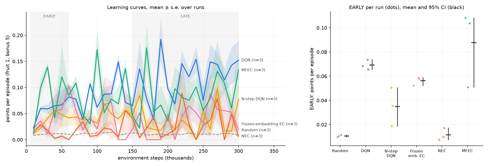

# Experiment report: NEC ablation ladder on 25×25 rooms with bonus food

**Status: stopped at the pilot gate, as pre-registered.** No confirmatory run was made, no hypothesis
was tested, and the plan was never frozen, because freezing happens only after the gate passes.

- **Plan:** [`PROTOCOL.md`](PROTOCOL.md), reviewed and approved for running on 2026-10-06.
- **Files as used for the pilot** (SHA-256):

  | File | SHA-256 |
  |---|---|
  | `PROTOCOL.md` | `605a8a9227759681e88e2b1bd186860a0a0506a44a73fad30e2aabf4b5e8380f` |
  | `run.sh` | `592e7216e9b9b3c8dc1ec3d075516cc2302a0db7af02561c8f74115eb4fe0dee` |
  | `analyze.py` | `e8195a4a32f2a9f0d7f095b872a5e1b4e8d31864a69ce610bbb8da11cea3c5d4` |

  `run.sh` is the version with `STEPS=300000`, the gate's only permitted change.
- **Pilot runs (2026-10-06):**
  - 150k steps: 18:10Z – 18:26Z, in `results/exp_nec_ladder/pilot_150k/`.
  - 300k steps: 18:26Z – 19:04Z, in `results/exp_nec_ladder/pilot_300k/`.
  - All 36 runs completed. The log is `logs/exp_nec_ladder_pilot.log`.
- **Raw outputs:** [`pilot_gate_150k.txt`](pilot_gate_150k.txt), [`pilot_gate_300k.txt`](pilot_gate_300k.txt),
  [`pilot_300k_learning_curves.png`](pilot_300k_learning_curves.png).

## 1. Recap of the plan

**Question.** Which of NEC's three components (N-step returns, episodic memory, a learned embedding)
produces its gain in data efficiency over DQN?

**Method.** An ablation ladder that adds one component at a time:
`dqn` → `dqn_nstep` → `ec_frozen` → `nec`, with `random` and `mfec` as references.

**Environment.** Chosen to be harder than the previous experiment's:
- a 25×25 board with the `rooms` map;
- bonus food worth 5 points (appears after every 4 regular fruit and lasts 50 steps);
- an idle limit of 1,250 steps.

**Confirmatory design.** Five hypotheses on EARLY score, 15 seeds per agent, permutation tests with
Holm correction.

**The gate (PROTOCOL section 10).** It came before all of that. Its purpose was to make sure agents
learn at all on this board, because a ladder of agents that never leave the random floor says nothing
about their components.
- A ladder agent clears the floor if its mean LATE score over 3 pilot seeds is at least 0.5 points
  above `random`'s.
- At least 3 of the 4 ladder agents must clear it.
- If the gate fails at 150k steps, the budget doubles to 300k once. If it fails again, the experiment
  stops.

## 2. Gate outcome

LATE = mean points per episode over the second half of training, mean of 3 seeds.

| Agent | 150k steps | 300k steps | Needed |
|---|---|---|---|
| Random | 0.012 | 0.010 | — |
| DQN | 0.087 | 0.120 | ≥ 0.51 |
| N-step DQN | 0.041 | 0.037 | ≥ 0.51 |
| Frozen-embedding EC | 0.032 | 0.038 | ≥ 0.51 |
| NEC | 0.021 | 0.028 | ≥ 0.51 |
| **Gate** | **failed, 0 of 4** | **failed, 0 of 4** | 3 of 4 |

No agent came within a quarter of the threshold, and doubling the budget did not move any agent
closer in a meaningful way. Following the protocol, the experiment stops here.

*Pilot at 300k steps, 3 seeds per agent.* Every learner stays between 0 and about 0.15 points per
episode throughout. The right panel's ordering rests on 3 seeds of near-zero scores, and it is
**not interpretable**, so the report draws no conclusion from it.

## 3. Why the setup is not informative

The pilot data are reported in full as protocol section 10 requires. All numbers below are from the
300k pilot and are descriptive.

| Agent | Episodes per run | LATE steps per episode | LATE share cut off by idle limit | Regular fruit per 60k-step block | Bonus pellets eaten per run |
|---|---|---|---|---|---|
| Random | 36,926 | 8 | 0% | 77, 90, 78, 78, 77 | 0 |
| DQN | 1,309 | 369 | 5% | 23, 15, 14, 22, 21 | 0 |
| N-step DQN | 1,195 | 490 | 19% | 11, 8, 6, 3, 6 | 0 |
| Frozen-embedding EC | 778 | 819 | 46% | 12, 4, 1, 3, 4 | 0 |
| NEC | 1,772 | 451 | 20% | 11, 5, 4, 3, 5 | 0 |
| MFEC | 779 | 825 | 49% | 15, 7, 6, 6, 6 | 0 |

**1. The agents learn to survive, not to eat.**
- Every learner's episodes are 45–100× longer than random's, so they did learn to avoid walls and
  their own body.
- But they find food *less* often over time. NEC goes from 11 fruit in the first 60k steps to 3–5
  per 60k afterwards.
- On this board the only frequent signal is the −1 for dying, and food is too rare for its +1 to
  shape the policy.
- Wandering costs nothing: an episode cut off by the idle limit still bootstraps, as designed.

**2. Exploration ends long before food is found reliably.**
- run.py's ε schedule reaches its 0.02 floor after 5,000 steps, a few hundred episodes into training.
  That suits a 7×7 board, but here a near-greedy policy rarely stumbles onto food.
- Averaged over the five blocks, the random policy collects about 4× more fruit than DQN and 10–17× more than the other learners. Part of that is
  turnover (every restart puts it near the centre, with fresh food), but it also shows how little the
  learners explore.

**3. The bonus food never appeared.**
- A pellet spawns only after 4 regular fruit *within one episode*. No agent ever ate 4 in one
  episode, so in 36 runs and 8.1 million steps, zero pellets were eaten.
- The "rewards of different size" feature that motivated this environment was inert. It would stay
  inert at any budget until agents can already eat several fruit per episode.

**4. The 300k budget is not the bottleneck.** The flat or falling fruit counts per block show no
trend that more steps would extend. Doubling again would be a guess, and the protocol does not allow it.

Assumption checks A2–A9 (PROTOCOL section 9) were designed for the confirmatory runs and are not
evaluated. A1 ("every ladder agent learns") is what the gate tests, and it failed for every ladder agent.

## 4. Deviations and disclosures

- **Deviations:** none. The gate was applied as written. The only change to any file was `STEPS`
  150000 → 300000, which the gate rule prescribes. The 150k pilot files were moved to `pilot_150k/` so
  the 300k rerun would not overwrite them.
- **Disclosure:** while debugging `analyze.py` (procedure step 0), throwaway 30k-step runs on seeds
  901–903 showed that the gate fails at 30k steps. Their scores were not otherwise read, and that
  observation did not change the plan.

## 5. Recommendations for a redesigned experiment

These are proposals for the next protocol, not conclusions of this one.

1. **Calibrate the environment before writing hypotheses.** Add a pre-registered calibration stage
   that runs only `dqn` and `random` over a few board sizes (for example 11, 15, 19). Pick the largest
   board where DQN clears the gate within a feasible budget. Choosing the environment from DQN alone
   keeps the ladder comparison blind.
2. **Make exploration a run setting.** Add `--eps-decay STEPS` to run.py (default 5,000, which leaves
   old runs unchanged), and use a decay of the order of the budget's first 20–30% on large boards.
   Per CLAUDE.md, run settings belong in run.py, not in agent names.
3. **Make the bonus reachable.** For example, spawn it on a timer, or after every regular fruit with a
   probability, rather than after 4 fruit in one episode. Then the reward-size factor actually exists.
   This changes the env only when `bonus > 0`, so default runs stay bit-for-bit identical.
4. **Keep the rest of the design.** The ladder, hypotheses, outcome windows, tests, assumption checks
   and analysis code can be reused unchanged once the environment passes a gate.

## 6. Conclusion

On a 25×25 rooms board with this bonus rule and run.py's 5k-step exploration schedule, none of the
agents learns to collect food within 300k steps. They learn only to avoid dying. The pre-registered
gate caught this before any confirmatory run, so the question of which NEC component drives data
efficiency remains open: this environment cannot answer it. The next experiment should change the
environment (board size, exploration schedule, bonus rule) and reuse the rest of this design.
