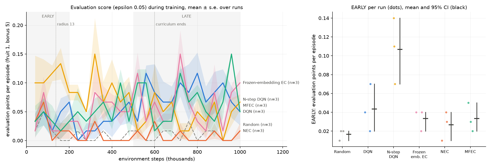

# Experiment report (v3): NEC ablation ladder with a food-distance curriculum

**Status: stopped at the pilot gate, as pre-registered.** No confirmatory run was made, and no hypothesis
was tested. `FROZEN.sha256` was never written, because freezing happens only after a passed gate. The
files below are the ones committed as the pre-registration (`83e7ab0`), unchanged since.

| File | SHA-256 |
|---|---|
| `PROTOCOL.md` | `ee8f61b1f1332aad4a99a611a93107a82c232faae25a14614214a8aaf3b6594d` |
| `run.sh` | `a1d1b4145fd8605a2930416289ae1689527ac4e5941610903f8a253c5460ae02` |
| `analyze.py` | `38f177be05177c5c476675f7c2cd80a6ba63bd6d0ddc7a75b34b93abb14a4221` |

- **Pilot:** 2026-10-07, 07:05Z to 09:13Z. 18 of 18 runs completed (seeds 1–3, 1M steps), stored in
  `results/exp_nec_ladder_curriculum/pilot/`, with the log in `logs/exp_nec_ladder_curriculum_pilot.log`.
- **Outputs:** [`pilot_gate.txt`](pilot_gate.txt) and [`pilot_learning_curves.png`](pilot_learning_curves.png).

## 1. Recap

v3 was v2 plus one change: training with a **food-distance curriculum**, `--food-curriculum 2:600000`.
- **How it works:** regular food is placed within *r* walkable steps of the head, with *r* growing
  linearly from 2 to 50 over 600k steps; after that, food goes anywhere.
- **Unchanged from v2:**
  - each paper's ε schedule: DQN family 1 → 0.1 over 250k steps; episodic agents fixed at 0.005;
  - evaluation runs at ε 0.05, always with food anywhere;
  - 1M steps;
  - the ladder, hypotheses and gate.

**The gate:** the mean evaluation LATE (steps 500k–1M) over 3 seeds had to be at least 0.5 points above
`random`'s, for at least 3 of the 4 ladder agents.

## 2. Gate outcome

| Agent | Evaluation LATE per seed | Mean | Needed | |
|---|---|---|---|---|
| Random | 0.000, 0.012, 0.016 | 0.009 | — | |
| DQN | 0.092, 0.064, 0.084 | 0.080 | ≥ 0.509 | fail |
| N-step DQN | 0.044, 0.040, 0.044 | 0.043 | ≥ 0.509 | fail |
| Frozen-embedding EC | 0.040, 0.056, 0.092 | 0.063 | ≥ 0.509 | fail |
| NEC | 0.008, 0.004, 0.008 | 0.007 | ≥ 0.509 | fail |
| MFEC (reference) | 0.072, 0.064, 0.060 | 0.065 | — | |
| **Gate** | | | 3 of 4 | **failed, 0 of 4** |

The scores are essentially v2's: DQN 0.069, N-step 0.040, frozen EC 0.084, NEC 0.005. The curriculum did
not move any agent toward the bar. Following the protocol, the experiment stops.

*Evaluation score (food anywhere) during training, 3 seeds per agent.* The dotted lines mark where the
radius reaches 13 (137.5k) and where the curriculum ends (600k). Nothing changes at either. The right
panel rests on 3 seeds of near-zero scores and is not interpretable.

## 3. Why the curriculum did not help (descriptive, as protocol section 10 requires)

| Agent | Training regular fruit per 100k steps (first five blocks → rest) | Evaluation score per 200k-step block | LATE training episode length (idle cut-offs) | Bonus pellets per run |
|---|---|---|---|---|
| Random | 1,608, 237, 115, 125, 134 → ~128 | 0.017, 0.007, 0.007, 0.013, 0.010 | 8 (0%) | 0 |
| DQN | **1,716**, 251, 84, 73, 72 → ~80 | 0.043, 0.020, 0.070, 0.087, 0.073 | 81 (0%) | 0.3 |
| N-step DQN | **1,830**, 313, 95, 53, 47 → ~62 | 0.107, 0.090, 0.057, 0.040, 0.043 | 66 (0%) | 0 |
| Frozen-embedding EC | **72**, 11, 5, 6, 6 → ~6 | 0.033, 0.050, 0.063, 0.063, 0.060 | 1,017 (71%) | 0 |
| NEC | **44**, 4, 2, 1, 2 → ~1 | 0.027, 0.007, 0.010, 0.003, 0.007 | 438 (12%) | 0 |
| MFEC | **97**, 11, 6, 3, 6 → ~7 | 0.033, 0.047, 0.070, 0.067, 0.070 | 900 (55%) | 0 |

**Check A11 ("the curriculum provides a learning signal") failed, for two different reasons:**

**1. Timing: the DQN family was exploring while food was close.**
- The radius is smallest during the first ~137k steps. In that same period, the DQN family's ε is still
  falling from 1 toward 0.1 (it gets there at 250k steps).
- So its first-100k fruit count (1,716 and 1,830) is the random policy's (1,608). It ate the nearby food
  by acting randomly, not by seeking it.
- By the time it acts greedily, the radius is about 24, and food is effectively anywhere again.
- From then on, it collects *fewer* fruit than random: about 60–80 per 100k against about 128.

**2. Placement: the episodic agents leave nearby food behind.** Food is placed near the head only at the
moment of placement, at an episode start or right after eating.
- **Random** dies within ~8 steps, and every restart puts fresh food 2 steps away. Turnover alone gives
  it ~1,600 fruit in the first 100k steps.
- **The episodic agents** (ε = 0.005) act near-greedily from the start, but do not head for food yet.
  They wander away, leave the nearby food behind, and drift until the 1,250-step idle limit ends the
  episode: 55–71% of frozen-EC and MFEC training episodes end that way.
- **The result:** 44–97 fruit in the first 100k steps, *less than a twentieth of random's*, with food
  never more than 10 steps away at placement. NEC collected the least: 44 fruit, then 1–2 per 100k for
  the rest of training. Its evaluation score stayed at the random floor.

**Bonus food came into play only once:** a single pellet, in one DQN run (A4).

**NEC's fragility from v2 is still there:** at evaluation ε 0.05, its episodes are 70 steps long, against
438 in training.

Checks A2–A10 were designed for the confirmatory runs and are not evaluated. A1 is the gate, and it
failed.

## 4. Deviations and disclosures

- **Deviations:** none. The gate was applied as written, and no protocol file changed after `83e7ab0`.
- **Disclosures:**
  - Partial pilot results were looked at while the pilot ran, as runs finished. That changed nothing in
    v3, and the pilot data cannot change a protocol.
  - The diagnosis above **did** shape v4's design, which is the purpose of a stopped pilot.

## 5. What v4 changes

Both flaws have a direct fix. v4 (`docs/experiments/nec_ladder_g25_food_relocation/`) was approved in
advance:
1. **Hold, then grow** (`--food-curriculum 2:250000:600000`). The radius stays at 2 until step 250k, when
   DQN's ε decay ends, and only then grows. The DQN family gets an easy phase while acting greedily, and
   the episodic agents get a longer one.
2. **Food relocation** (`--food-relocate`). While the curriculum is active, food the snake has not eaten
   within 2r + 5 steps is placed again within r of the head's *current* position. A wandering agent then
   always has food nearby, and its episode is not cut short.

Everything else stays as in v3.

## 6. Conclusion

A food-distance curriculum that places food near the snake only at placement time did not change the
outcome. Every agent scored as in v2, and none got even a sixth of the way to the gate. The pilot data show why:
- **the DQN family** was still exploring randomly while food was close;
- **the episodic agents** wandered away from it.

Training fruit counts make both visible: they match random's for the DQN family, and fall below 1/20 of
it for the episodic agents. v4 addresses both mechanisms directly.
