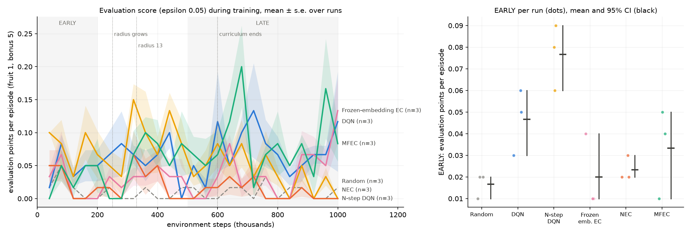

# Experiment report (v4): NEC ablation ladder with a held food curriculum and food relocation

**Status: stopped at the pilot gate, as pre-registered.** No confirmatory run was made, and no hypothesis
was tested. `FROZEN.sha256` was never written. The files below are the pre-registration (`968298f`),
unchanged since.

| File | SHA-256 |
|---|---|
| `PROTOCOL.md` | `47dfc57ebaea92c648136ee80fb701733f3ebbfe49d814b12773e942fc3273bb` |
| `run.sh` | `585032990afed9de4f1be07564b189ad45cf215654003cd8bbbb47243c6aea9a` |
| `analyze.py` | `08227f3f8ccb0da9bf1e6a3c371b1ce7e0b46c0a7df0f2bb4f11a272bd58583f` |

- **Pilot:** 2026-10-07, 09:23Z to 12:10Z. 18 of 18 runs completed (seeds 1–3, 1M steps), stored in
  `results/exp_nec_ladder_relocation/pilot/`, with the log in `logs/exp_nec_ladder_relocation_pilot.log`.
- **Outputs:**
  - [`pilot_gate.txt`](pilot_gate.txt).
  - [`pilot_learning_curves.png`](pilot_learning_curves.png), drawn by `analyze.figure`. For this figure
    only, the "radius 13" milestone label was lowered so it does not overlap "radius grows";
    `analyze.py` itself is unchanged.

## 1. Recap

v4 was v3 plus two fixes for the mechanisms v3's pilot exposed:
- **Hold, then grow:** `--food-curriculum 2:250000:600000`. The food radius stays at 2 until DQN's ε
  decay ends (250k steps), then grows until food goes anywhere at 600k steps.
- **Food relocation:** `--food-relocate`. During the curriculum, food not eaten within 2r + 5 steps is
  placed again within r of the head.

Everything else was unchanged:
- each paper's ε schedule;
- evaluation runs at ε 0.05, with food anywhere and no relocation;
- 1M steps;
- the ladder, hypotheses and gate: mean evaluation LATE at least 0.5 points above `random`, for 3 of the
  4 ladder agents.

## 2. Gate outcome

| Agent | Evaluation LATE per seed | Mean | v3 | v2 | Needed | |
|---|---|---|---|---|---|---|
| Random | 0.000, 0.012, 0.016 | 0.009 | 0.009 | 0.009 | — | |
| DQN | 0.080, 0.096, 0.040 | 0.072 | 0.080 | 0.069 | ≥ 0.509 | fail |
| N-step DQN | 0.048, 0.048, 0.024 | 0.040 | 0.043 | 0.040 | ≥ 0.509 | fail |
| Frozen-embedding EC | 0.016, 0.056, 0.052 | 0.041 | 0.063 | 0.084 | ≥ 0.509 | fail |
| NEC | 0.000, 0.028, 0.004 | 0.011 | 0.007 | 0.005 | ≥ 0.509 | fail |
| MFEC (reference) | 0.068, 0.088, 0.096 | 0.084 | 0.065 | — | — | |
| **Gate** | | | | | 3 of 4 | **failed, 0 of 4** |

Evaluation scores on the real game are unchanged across v2, v3 and v4. Following the protocol, the
experiment stops.

*Evaluation score (food anywhere) during training, 3 seeds per agent.* The dotted lines mark three
milestones: the radius starts growing (250k), reaches 13 (~330k), and the curriculum ends (600k). The
right panel is not interpretable at this level.

## 3. What happened (descriptive, as protocol section 10 requires)

### 3.1 The curriculum now provides plenty of reward (A11 holds)

Training regular fruit per 100k-step block, mean of 3 seeds:

| Agent | 0–100k | 100–200k | 200–300k | 300–400k | 400k–1M (per block) | Bonus pellets per run (training) |
|---|---|---|---|---|---|---|
| Random | 6,620 | 6,610 | 4,608 | 260 | 123–134 | 5 |
| DQN | 8,223 | 10,811 | 5,841 | 220 | 63–97 | 15 |
| N-step DQN | 7,984 | 11,202 | 9,965 | 356 | 76–112 | 20 |
| Frozen-embedding EC | 1,731 | 4,737 | 4,133 | 55 | 3–20 | 9 |
| NEC | 6,762 | 8,052 | 4,364 | 63 | 1–13 | 28 |
| MFEC | 4,132 | 6,069 | 4,290 | 191 | 6–60 | 23 |

- **Many times v3's signal:** the episodic agents get tens of times more fruit than in v3 (44–97 in the
  first 100k there). Every agent now eats thousands of fruit while the radius is held.
- **Bonus pellets appear in training** for every agent: 5–28 per run, against at most 1 in v1–v3.

None appeared in any evaluation run.

### 3.2 But no agent learned to *move toward* food, even two cells away

The held phase (100k–250k steps) is the easiest possible version of the task: food within 2 walkable
steps, moved back within 2 steps if not eaten within 9. A snake that steers toward food should eat
roughly every few steps.

| Agent | Fruit per training episode | Steps per episode | **Fruit per 100 steps** |
|---|---|---|---|
| Random | 0.5 | 8 | 6.6 |
| DQN | 1.7 | 16 | 10.3 |
| N-step DQN | 2.1 | 17 | 12.5 |
| Frozen-embedding EC | 3.9 | 80 | 4.9 |
| NEC | 2.8 | 207 | 1.4 |
| MFEC | 4.3 | 76 | 5.6 |

- **The DQN family** eats about 1.5–2× as often per step as random: some food-directed behaviour, but
  far from steering.
- **The episodic agents** eat *less often per step than random*. Their episodes are long because they
  learned to avoid dying; they did not learn to collect the food next to them.
- **NEC** is the clearest case: 1.4 fruit per 100 steps, with food never more than 2 steps away.

### 3.3 What was learned does not extend to food further away

Training fruit per 20k steps as the radius starts growing:

| Steps | Radius | Random | DQN | N-step DQN | Frozen EC | NEC | MFEC |
|---|---|---|---|---|---|---|---|
| 240–260k | 2 | 1,272 | 1,370 | 3,036 | 1,268 | 1,195 | 1,221 |
| 260–280k | 4 | 474 | 482 | 772 | 253 | 362 | 371 |
| 280–300k | 7 | 185 | 176 | 231 | 60 | 132 | 130 |
| 300–320k | 10 | 103 | 94 | 133 | 28 | 34 | 66 |
| 340–360k | 15 | 43 | 35 | 65 | 8 | 9 | 34 |
| 380–400k | 21 | 26 | 27 | 35 | 6 | 3 | 21 |

- **By radius 4:** every agent's food rate falls by roughly two thirds.
- **By radius 10–12:** every agent is at or below random, and evaluation never moves.
- **The best agent:** N-step DQN keeps a margin over random the longest, but it shrinks with every block.

### 3.4 Interpretation: the observation is the bottleneck, more than the curriculum or the algorithm

The pattern across v1–v4 is now consistent:
- **v1–v3:** too little reward.
- **v4:** plenty of reward, but no skill that reaches beyond the food 2 cells away.

The most likely common cause is **the observation**:
- **The input:** a flattened top-down image of the 25×25 board, read by an MLP.
- **The consequence:** "food is two cells ahead-left" is a different input pattern at each of the 625
  head positions and 4 headings. The MLP has no built-in notion that these are the same situation, and
  must learn each one separately.
- **Why NEC is hit hardest:** NEC compares situations by distance in its embedding space, so this weighs
  on it most of all. That fits NEC being the weakest agent in every version.

This is a hypothesis from the pilots, not a tested result.

**It also explains why the earlier small-board results looked fine:** on 7×7 there are only 49
positions, few enough to learn one by one.

## 4. Deviations and disclosures

- **Deviations:** none. The gate was applied as written, and no protocol file changed after `968298f`.
- **Disclosures:**
  - Pilot results were analysed in full after the pilot, as the protocol requires.
  - The pilot figure's label adjustment is cosmetic, and was done outside `analyze.py`.

## 5. Next steps (for discussion; not pre-registered)

1. **A snake's-eye observation** (centred on the head, rotated so the snake faces "up"). "Food two cells
   ahead-left" then becomes one input pattern everywhere on the board. This directly targets the
   suspected bottleneck. It changes the task representation, not the algorithms.
2. **CNN encoders** (`*_cnn`, already implemented): convolutions share weights across positions. On their
   own they still end in a position-specific layer, so they would likely work best with option 1.
3. **A sanity check before any new ladder:** run DQN alone on 7×7, 13×13 and 25×25 with the new
   observation, and confirm it learns to steer to food (fruit per 100 steps clearly above random during
   the held phase).
4. **Keep v4's curriculum.** It solved the signal problem (A11), so the next version should build on it.

## 6. Conclusion

v4's held curriculum with relocation did what it was designed to do: every agent now gets thousands of
rewards early, and bonus food finally appears. But no agent learned to steer to food even when it is
2 cells away, and what was learned fails as soon as food moves further. Evaluation on the real game is
the same as in v2 and v3. Across four versions, the evidence now points to the representation (a
top-down 25×25 image read by an MLP) as the main obstacle, rather than the exploration schedule, the
scoring, or the reward signal.
