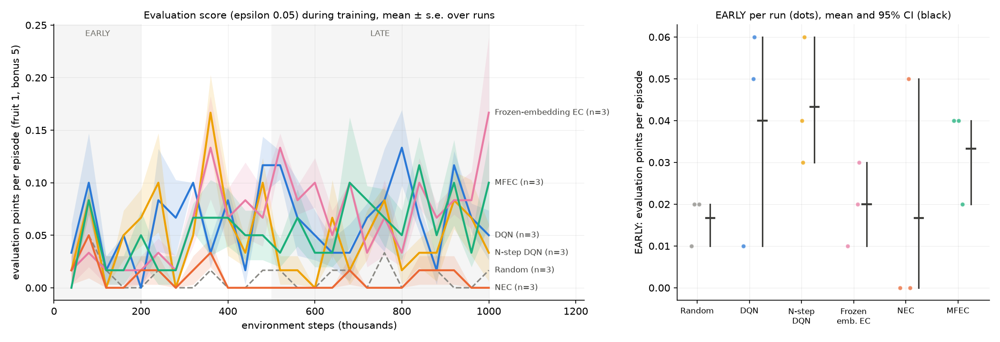

# Experiment report (v2): NEC ablation ladder, paper exploration schedules, evaluation runs

**Status: stopped at the pilot gate, as pre-registered.** No confirmatory run was made, and no
hypothesis was tested. Because freezing happens only after a passed gate, `FROZEN.sha256` was never
written. The files below are the ones committed as the pre-registration (`488146b`) before the
pilot finished, unchanged since.

| File | SHA-256 |
|---|---|
| `PROTOCOL.md` | `934e114dd51dd68337bd1c791beab81b1cc5bc6eab2b235d1027b51bc8ca0535` |
| `run.sh` | `205a3e6208b59a5cb0effc99524d19d9fa134979226f9705a80b6c54301e0da3` |
| `analyze.py` | `b450436f01c6898e8e42063bf9ef2c786009b7f55d406efbe234705943d27600` |

- **Pilot:** 2026-10-06, 20:48Z to 22:53Z. 18 of 18 runs completed (seeds 1–3, 1M steps each),
  stored in `results/exp_nec_ladder_paper_eps/pilot/`, with the log in
  `logs/exp_nec_ladder_paper_eps_pilot.log`.
- **Outputs:** [`pilot_gate.txt`](pilot_gate.txt) and [`pilot_learning_curves.png`](pilot_learning_curves.png).

## 1. Recap

v2 asked v1's question: which of NEC's components (N-step returns, episodic memory, a learned
embedding) produces its data-efficiency gain over DQN? The environment was the same: 25×25 `rooms`,
bonus food worth 5 points. Three design flaws found after v1's failed gate were fixed:
- **Each agent explored as in its paper:**
  - DQN and N-step DQN: ε 1 → 0.1 over 250k steps, then 0.1.
  - NEC, frozen-embedding EC and MFEC: a fixed ε of 0.005.
- **Every outcome was scored on evaluation runs:** 5 episodes at ε 0.05 every 10k steps, on a separate
  env copy, as in the DQN paper.
- **The budget was 1M steps,** about 4M Atari frames.

**The gate** (PROTOCOL section 10):
- A ladder agent clears the floor if its mean evaluation LATE (steps 500k–1M) over 3 pilot seeds is
  at least 0.5 points above `random`'s.
- At least 3 of the 4 ladder agents must clear it.
- If the gate fails, the experiment stops. There was no budget increase this time.

## 2. Gate outcome

| Agent | Evaluation LATE (mean of 3 seeds) | Needed | |
|---|---|---|---|
| Random | 0.009 | — | |
| DQN | 0.069 | ≥ 0.509 | fail |
| N-step DQN | 0.040 | ≥ 0.509 | fail |
| Frozen-embedding EC | 0.084 | ≥ 0.509 | fail |
| NEC | 0.005 | ≥ 0.509 | fail |
| **Gate** | | 3 of 4 | **failed, 0 of 4** |

The best agent is about a sixth of the way to the threshold, and NEC is at the random floor.
Following the protocol, the experiment stops here.

*Evaluation score during training, 3 seeds per agent.* Every agent stays below 0.25 points per episode
for the whole 1M steps. The right panel's ordering rests on 3 seeds of near-zero scores and is **not
interpretable**.

## 3. What the agents did (descriptive, as protocol section 10 requires)

Means over the 3 pilot seeds.

| Agent | Training ε | Training episodes per run | LATE training episode length | LATE training episodes cut off by idle limit | Regular fruit per 200k training steps | Evaluation score per 200k-step block | LATE evaluation episode length |
|---|---|---|---|---|---|---|---|
| Random | — | 122,849 | 8 | 0% | 269, 259, 248, 250, 265 | 0.017, 0.007, 0.007, 0.013, 0.010 | 8 |
| DQN | 1 → 0.1 | 27,071 | 63 | 0% | 265, 128, 131, 140, 166 | 0.042, 0.075, 0.053, 0.058, 0.057 | 144 |
| N-step DQN | 1 → 0.1 | 26,345 | 52 | 0% | 278, 109, 102, 125, 136 | 0.043, 0.077, 0.033, 0.047, 0.050 | 121 |
| Frozen-embedding EC | 0.005 | 1,220 | 918 | 62% | 7, 12, 11, 12, 13 | 0.020, 0.063, 0.093, 0.057, 0.100 | 312 |
| NEC | 0.005 | 2,255 | 465 | 13% | 4, 3, 4, 2, 2 | 0.017, 0.013, 0.000, 0.003, 0.010 | 75 |
| MFEC | 0.005 | 1,174 | 963 | 61% | 5, 8, 11, 8, 14 | 0.033, 0.047, 0.047, 0.067, 0.080 | 311 |

Bonus pellets eaten: **zero** in all 18 runs, in training and in evaluation.

**1. Paper-faithful exploration did not rescue learning; it split the agents into two failure modes.**
- **The DQN family** keeps ε at 0.1. Its training episodes are short (about 55 steps), and it eats
  about 130 fruit per 200k steps, mostly from turnover: it dies and restarts near new food. Evaluated
  at ε 0.05, it scores a flat 0.04–0.08 after the first 200k steps. It survives longer than random
  (about 130 steps), but it does not head for food.
- **The episodic agents** explore with ε = 0.005. In training they mostly wander: 61–62% of
  frozen-embedding EC and MFEC episodes end at the 1,250-step idle limit. They find only 2–14 fruit
  per 200k steps, so their memories hold almost no positive returns to read from.
  - **NEC is worst:** 2–4 fruit per 200k steps, and an evaluation score at the random floor.
  - **Frozen-embedding EC and MFEC** show the only upward drift (0.02 → 0.10). Whether it would ever
    reach the gate is unknown, and the protocol does not allow longer runs.

**2. The bottleneck is how rarely food is found, not the exploration schedule or the measurement.**
- v1 used one short schedule for everyone and scored training episodes; v2 used each paper's schedule,
  scored evaluation runs, and ran 3–7× longer. Both failed the same gate by a similar margin.
- On a 25×25 board with rooms, neither a long ε = 0.1 tail nor a near-greedy policy reaches food often
  enough for the value estimates to learn that food matters. The −1 for dying is still the only
  frequent signal.

**3. The bonus rule makes the reward-size question untestable here.** A pellet needs 4 regular fruit in
a single episode, and no agent ever got close.

**4. Evaluation reveals something training hides.** At ε 0.05, NEC's evaluation episodes are much
*shorter* than its training episodes (75 vs 465 steps): ten times more random actions than in training
kill it quickly. Its learned behaviour is fragile to small perturbations. The DQN family goes the other
way (144 vs 63 steps), because it trained with *more* noise than evaluation adds.

Assumption checks A2–A10 were designed for the confirmatory runs and are not evaluated. A1 ("every
ladder agent learns") is what the gate tests, and it failed for every ladder agent. A9 (evaluation
does not alter training) holds by the unit test.

## 4. Deviations and disclosures

- **Deviations:** none. The gate was applied as written. No file changed after the pre-registration
  commit.
- **Disclosure:** `analyze.py` was debugged on throwaway 60k-step runs (seeds 901–902) before the pilot,
  checking structure only (PROTOCOL section 4).

## 5. What this means, and next steps

Across v1 and v2, the same environment defeated every agent under three different exploration and
measurement setups, and under budgets from 150k to 1M steps. The ladder question cannot be answered
on this environment: there is no learning to decompose.

The next steps already discussed on PR #3 follow directly:
1. **Board size as a pre-registered factor** (e.g. 7, 13, 19, 25). This now looks essential, not
   optional: it would show *where* each agent stops learning, instead of only that all of them fail at
   25×25.
2. **A curriculum by growing the arena** inside the 25×25 frame. It attacks exactly the failure seen
   here: on a small arena food is close, so agents can learn that food matters before the board grows.
3. **A reachable bonus rule** (e.g. on a timer), so that reward size actually becomes part of the task.
4. **Exploration as a factor** (NEC and MFEC with DQN's decay vs their paper schedule). It matters less
   than it seemed after v1, since neither schedule helped here, but it stays relevant once agents learn.

## 6. Conclusion

Giving each algorithm its paper's exploration schedule, scoring on evaluation runs, and quadrupling the
budget did not change v1's outcome. On a 25×25 rooms board, no agent learns to collect food within 1M
steps. The DQN family stops improving early, and the episodic agents barely find food at all. NEC ends
at the random floor, the worst of the ladder. The pre-registered gate stopped the experiment before
any confirmatory run. The next design should vary board size or use a curriculum, so that agents have
a learnable starting point.
